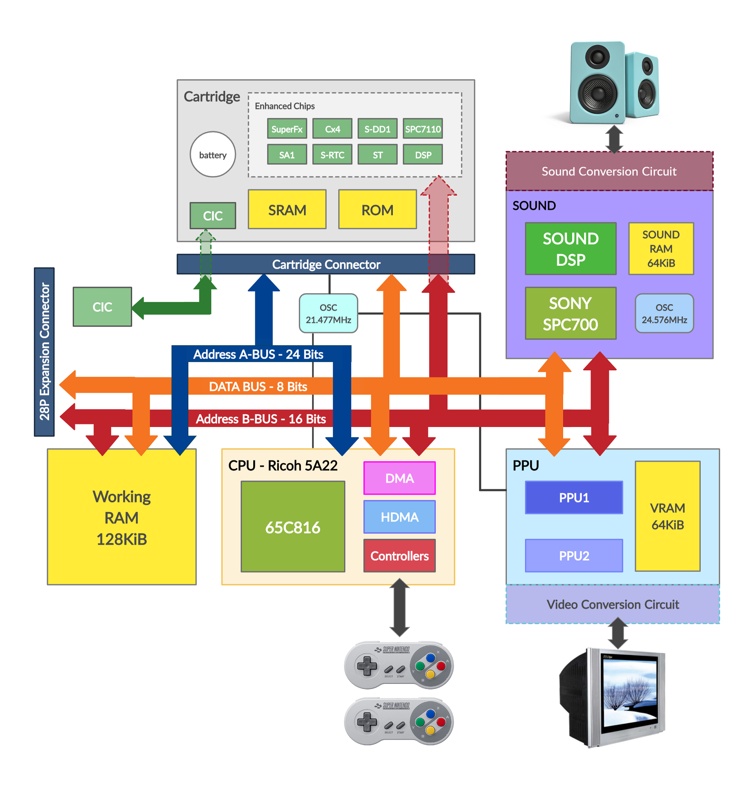
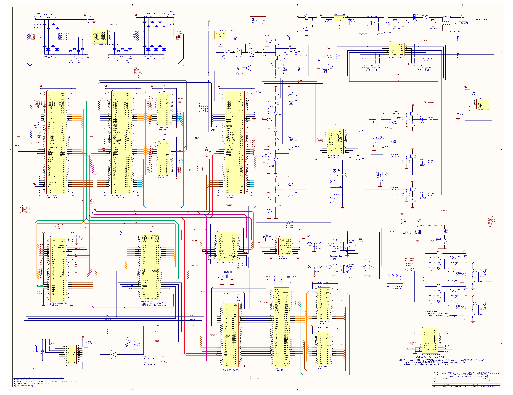
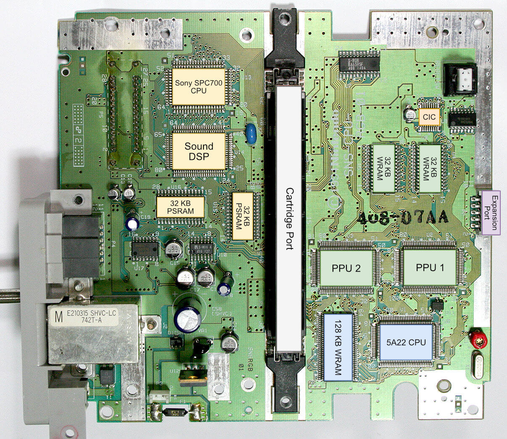

# Snes
Diagrama de blocos do Snes: 
 

## Barramentos:
&nbsp;&nbsp;O Snes possui 3 barramentos, sendo 2 de endereços, o A-Bus e o B-Bus, e um barramento de dados, o Data Bus. Os barramentos são as conexões (fios) que ligam os diferentes elementos na placa.

## Cpu Ricoh 5A22:
&nbsp;&nbsp;No Snes,  a cpu principal não apenas executa as instruções dos programas (jogos) mas também é responsável por outras tarefas, como Dma, gerenciamento dos controles, acesso aos barramentos entre outros.

## Working Ram:
&nbsp;&nbsp;Memória de trabalho do sistema.

## PPU:
&nbsp;&nbsp;Processa os gráficos, observe que fisicamente são dois chips, (ppu1 e ppu2), porém em assembly enxergamos como uma entidade única, não tendo diferença ser dividida quando formos programar. 
&nbsp;&nbsp;A Vram é a memória de trabalho do vídeo. 
&nbsp;&nbsp;Agora já o circuito de conversão de vídeo, essa parte do circuito não tem interface nenhuma com o software, algo em acesso ao software que não temos controle.

## Sound:
&nbsp;&nbsp;O Sony SPC700 e o Sound DSP, são os chips responsáveis pela parte de som do Snes; 
&nbsp;&nbsp;Temos 64KiB de Ram para processamento do som, e o clock principal de som roda a 24.576MHz. 
&nbsp;&nbsp;Assim como na PPU, o circuito responsável pela conversão de som não tem interface com o software.

## Cartridge Connector:
&nbsp;&nbsp;O conector de cartuchos é onde encaixamos nossos jogos. 
&nbsp;&nbsp;Ele possui todos os pinos necessários para que haja a comunicação do hardware do cartucho com os demais elementos internos do Snes.

## Cartridge:
&nbsp;&nbsp;É o hardware com diversos elementos onde encaixamos os cartuchos, dependedo da versão do Snes teremos expansões diferentes. 
&nbsp;&nbsp;Entenda o cartucho como sendo mais um elemento conectado no barramento assim como todos os outros elementos citados acima 
&nbsp;&nbsp;Note que há dois chips (SRam e Rom), conectados nos barramentos do console, são estes os chips de memória do cartucho.

## Cic:
&nbsp;&nbsp;Famoso anti-pirataria, Cic é um chip que faz authenticação com o cartucho, dentro do console existe um chip chamado Master, e dentro de cada cartucho existe um chamado Cic, quando o console é ligado, passa a ter uma conexão entre os dois chips, (essa comunicação é parelela ao jogo pois fica não fica ligado no barramento do cartucho). 
&nbsp;&nbsp;Se dentro do cartucho não tiver o Cic ou não seja o Cic correto, o console reinicia automaticamente e fica bloqueado, esse bloqueio acontece pois o Cic no console está conectado a um chip de RESET no console (não mostrado no diagrama de blocos), e se houver um problema é bloqueado o console. 
&nbsp;&nbsp;A grande sacada é o seguinte, apenas a Nintendo fabricava esse chip, logo as empresas fabricantes de jogos precisavam comprar esses chips, portando apenas originais rodavam, bloqueando jogos piratas, o sucesso desse mecanismo foi grande, porém um dia uma versão interna do software do Cic acabou vazando e todo o plano indo por água abaixo.

# Por fim os esquema geral do hardware do console: <small><small><small><small><small><small><small>(Precisaremos disto quando formos programar em assembly)</small></small></small></small></small></small></small>
 

# Placa mãe: <small><small><small><small><small><small><small>( É recomendado conhecer o hardware físico para ter uma visão geral do sistema em que estamos programando. Errata: a Vram são os dois chips de 32KiB localizados perto das PPUs. Na imagem está como “Wram”.)</small></small></small></small></small></small></small>
 
